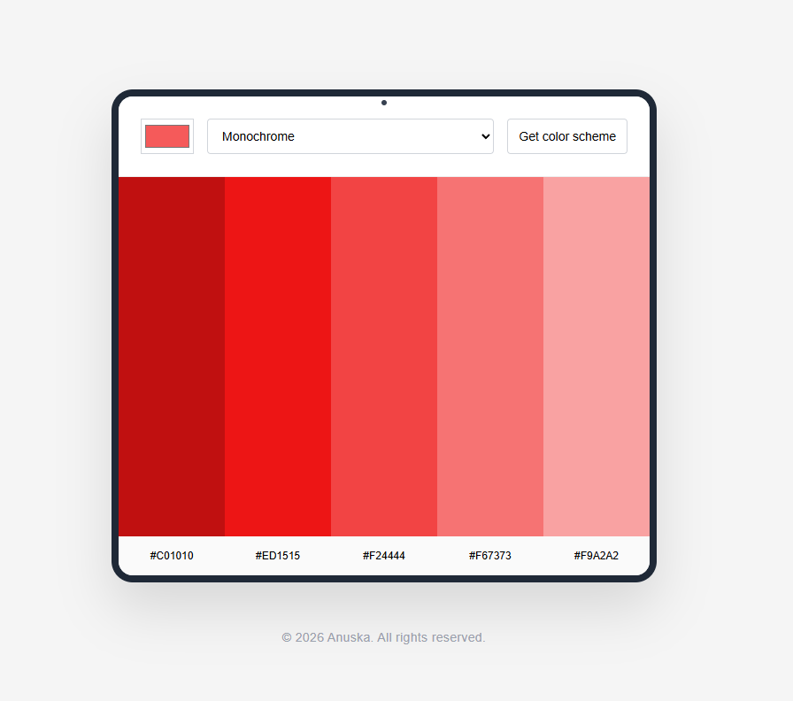

# color-scheme-generator#

🎨 Color Scheme Generator

A modern, responsive web application that generates professional color palettes using [The Color API](https://www.thecolorapi.com/). Designed with a sleek "tablet-style" interface and optimized for a clean user experience.

**[🌐 View Live Demo](https://color-scheme-generator-rust.vercel.app/)**



## ✨ Features

- **Seed Color Selection**: Choose a base color using a native color picker.
- **Multiple Modes**: Generate schemes based on Monochrome, Analogic, Complementary, Triad, and more.
- **Live Fetch**: Real-time data retrieval from The Color API.
- **Click-to-Copy**: Click any hex code or color swatch to instantly copy the value to your clipboard.
- **Modern UI**: A tablet-inspired "window" design with soft shadows and rounded corners.

## 🚀 Technologies Used

- **HTML5**: Semantic structure.
- **CSS3**: Custom properties, Flexbox, and Grid for the "Tablet" layout.
- **JavaScript (ES6+)**: DOM manipulation, Fetch API, and Clipboard API.
- **The Color API**: External data source for color theory calculations.

## 🛠️ How to Run

1. Clone this repository:
   ```bash
   git clone https://github.com/Anuska86/color-scheme-generator.git
   ```
2. Open index.html in your browser (or use VS Code Live Server).

3. Select a color, pick a mode, and click "Get color scheme".

📜 License

This project is licensed under the MIT License.

Developed by Ana Sappia Rey Web App Developer — 2026
